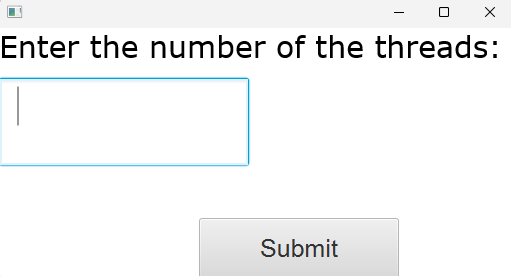
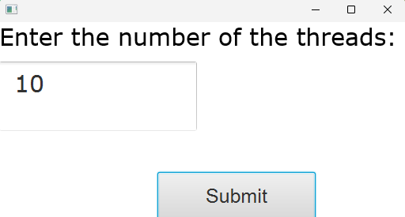
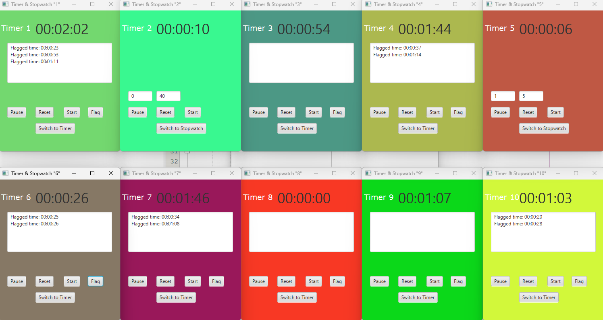

# Parallel Timer

> A multithreaded Java GUI application that creates multiple timers and stopwatches simultaneously.

### 1) Core Concepts
This project demonstrates the practical application of:
- Multithreading
- Thread Synchronization
- JavaFX GUI Development 

### 2) About
This repository contains the final team project developed for the `Parallel Processing and High-Performance Computing` course.

## 3) Screenshots

| Feature | Preview |
|---------|---------|
| User Prompt |  |
| User Input |  |
| Created Timers&Stopwatches |  |
